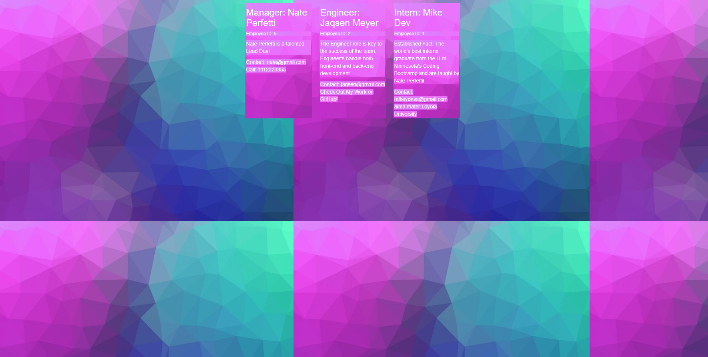

# Challenge-Week-10 Team Profile Generator

## Description

This application utilizes the command-line interface to build a roster for a Development Team and posts the roster to a 'testTeam.html' file. 

## Technologies Used

- HTML, CSS, JavaScript
- Bootstrap CSS Framework
- Node.js / Inquirer package

## Installation Instructions

Clone the repo to your local machine and launch in VS code. Within the integrated terminal you can run the program by utilizing the command "node index.js". Please make sure you have all the required programs and dependencies installed. 

## Future Development

Contrary to the standard in the industry, this application was built before TDD was performed. This is not a habit that will be continued, but for this assignment I built it this way because I had a limited amount of time. Future development involves building out several tests to run and making sure those tests all pass with the current version of code in prod. 

## Repository Link ↓

https://github.com/jaqsentanner/Challenge-Week-10

## Javascript Screenshots ↓

## Generated HTML Roster Screenshot ↓

## License

This project is unlicensed and intended to be shown in a learning envirnonment.